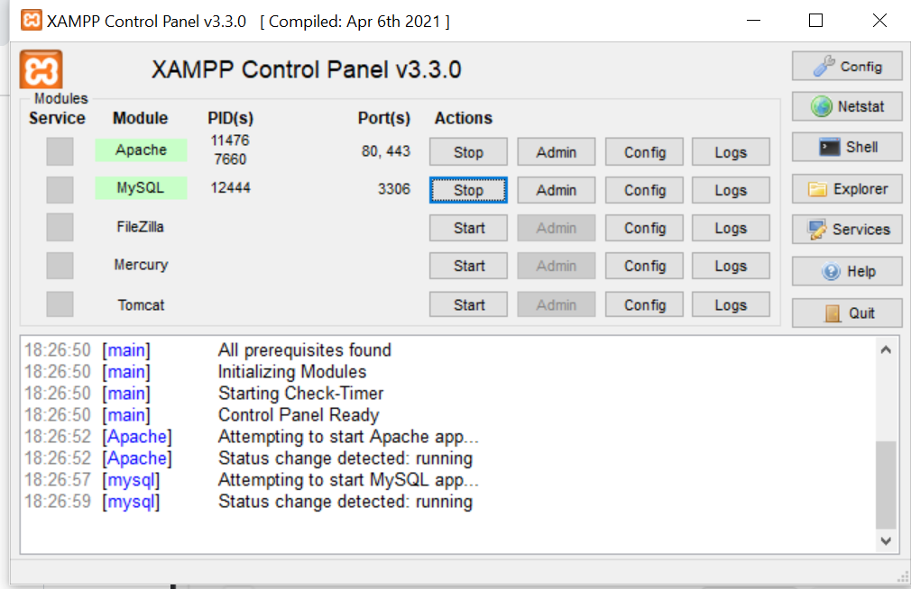

# Praktikum 7

---

- Nama : Aji Muhlisin
- NIM : 312010233
- Kelas : TI.20.B.1

---

- instalasi Web Server yaitu aplikasi XAMPP.
  

- Selanjutnya Menjalankan aplikasi Apache pada XAMPP.
  

- Membuka web server Chrome dengna dengan mengetikkan http://localhost/ dan tampilannya seberti di bwah ini.
  

### MENGOPRASIKAN PHP

- Membuat folder dengan nama lab_php_dasar.
  

- Berikut tampilan pada browser
  

### PHP DASAR

- Disini saya membuat sebuah file baru didalam folder lab_php_dasar yaitu dengan nama file php_dasar.php, dengan hasil Hello World.

```
<!DOCTYPE html>
<html lang="en">
<head>
    <meta charset="UTF-8">
    <meta http-equiv="X-UA-Compatible" content="IE=edge">
    <meta name="viewport" content="width=device-width, initial-scale=1.0">
    <title>PHP Dasar</title>
</head>
<body>

    <h1>Belajar PHP Dasar</h1>

    <?php
        echo "Hello World!";
    ?>

    <h1>Menambahkan Variable</h1>
    <?php
        $nim = "312010233";
        $nama = 'AJI MUHLISIN';
        echo "NIM : " . $nim . "<br>";
        echo "Nama : $nama";
    ?>

</body>
</html>
```

- Berikut hasil dan tampilan pada browser
  

### VARIABLE PHP

- Membuat variable pada PHP. Untuk variable, PHP menggunakan $ (dolar) untuk mendefinisikan.

```
<?php
        $nim = "312010233";
        $nama = 'AJI MUHLISIN';
        echo "NIM : " . $nim . "<br>";
        echo "Nama : $nama";
    ?>
```

- Berikut hasil dan tampilan pada browser
  

### PERDEFINE VARIABLE

- Disini saya akan membuat folder baru untuk Perdefine Variable dengan nama file latihan2.php

```
<!DOCTYPE html>
<html lang="en">
<head>
    <meta charset="UTF-8">
    <meta http-equiv="X-UA-Compatible" content="IE=edge">
    <meta name="viewport" content="width=device-width, initial-scale=1.0">
    <title>Predefine</title>
</head>
<body>
    <h2>Predefine Variable</h2>
    <?php
    echo'Selamat Datang ' .$_GET['nama'];
    ?>
</body>
</html>
```

- Berikut hasil dan tampilan pada browser
  

### MEMBUAT FORM INPUT

- Disini saya akan membuat folder baru untuk Form Input dengan nama file form_input.php

```
<!DOCTYPE html>
<html lang="en">
<head>
    <meta charset="UTF-8">
    <meta http-equiv="X-UA-Compatible" content="IE=edge">
    <meta name="viewport" content="width=device-width, initial-scale=1.0">
    <title>Form Input</title>
</head>
<body>
    <h2>Form Input</h2>
    <form method="post">
        <label>Nama: </label>
        <input type="text" name="nama">
        <input type="submit" value="Kirim">
    </form>
    <hr>
    <h3>Output</h3>
    <?php
        echo 'Selamat Datang ' .$_POST['nama'];
    ?>
</body>
</html>
```

- Berikut hasil dan tampilan pada browser
  

### OPERATOR PHP

- Disini saya akan membuat folder baru untuk Operator PHP dengan nama file operator.php

```
<!DOCTYPE html>
<html lang="en">
<head>
    <meta charset="UTF-8">
    <meta http-equiv="X-UA-Compatible" content="IE=edge">
    <meta name="viewport" content="width=device-width, initial-scale=1.0">
    <title>Operator</title>
</head>
<body>
    <h2>OPERATOR</h2>

    <?php
        $gaji = 1000000;
        $pajak = 0.1;
        $thp = $gaji - ($gaji*$pajak);
        echo "Gaji sebelum pajak = Rp. $gaji <br>";
        echo "Gaji yang dibawa pulang = Rp. $thp";
    ?>
</body>
</html>
```

- Berikut hasil dan tampilan pada browser
  

### KONDISI IF

- Disini saya akan membuat folder baru untuk Kondisi IF dengan nama file kondisiif.php

```
<h2>KONDISI IF</h2>

<?php
    $nama_hari = date("l");

    if ($nama_hari == "Sunday") {
        echo "Minggu";
    } elseif ($nama_hari == "Monday") {
        echo "Senin";
    } else {
        echo "Selasa";
    }
?>
```

- Berikut hasil dan tampilan pada browser
  

### KONDISI SWITCH

- Disini saya akan membuat folder baru untuk Kondisi Switch dengan nama file switch.php

```
<h2>KONDISI SWITCH</h2>

<?php
    $nama_hari = date("l");
    switch ($nama_hari) {
        case "Sunday":
            echo "Hari Minggu";
            break;
        case "Monday":
            echo "Hari Senin";
            break;
        case "Tuesday":
            echo "Hari Selasa";
            break;
        default:
            echo "Hari Sabtu";
        }
?>
```

- Berikut hasil dan tampilan pada browser
  

### PERULANGAN FOR

- Disini saya akan membuat folder baru untuk Perulangan For dengan nama perulangan_for.php

```
<h2>PERULANGAN FOR</h2>

<?php
    echo "Perulangan 1 sampai 10 <br />";

    for ($i=1; $i<=10; $i++) {
        echo "Perulangan ke: " . $i . '<br />';
    }

    echo "<hr>";
    echo "Perulangan Menurun dari 10 ke 1 <br />";
    for ($i=10; $i>=1; $i--) {
        echo "Perulangan ke: " . $i . '<br />';
    }
?>
```

- Berikut hasil dan tampilan pada browser
  

### PERULANGAN WHILE

- Disini saya akan membuat folder baru untuk Perulangan While dengan nama while.php

```
<h2>PERULANGAN WHILE</h2>

<?php
    echo "Perulangan 1 sampai 10 <br />";

    $i=1;
        while ($i<=10) {
            echo "Perulangan ke: " . $i . '<br />';
            $i++;
        }
?>
```

- Berikut hasil dan tampilan pada browser
  

### PERULANGAN DO WHILE PHP

- Disini saya akan membuat folder baru untuk Perulangan Do While PHP dengan nama dowhile.php

```
<h2>PERULANGAN DOWNHILE</h2>

<?php
    echo "Perulangan 1 sampai 10 <br />";

    $i=1;
        do {
            echo "Perulangan ke: " . $i . '<br />';
            $i++;
        } while ($i<=10);
?>
```

- Berikut hasil dan tampilan pada browser
  

### Jawaban Tugas

- Berikut adalah hasil dari inputan program php yang sudah saya inputkan dengan nama file index.php dengan menampilkan nama, tanggal lahir dan pekerjaan, seperti di bawah ini.


- hasil outputnya
  
